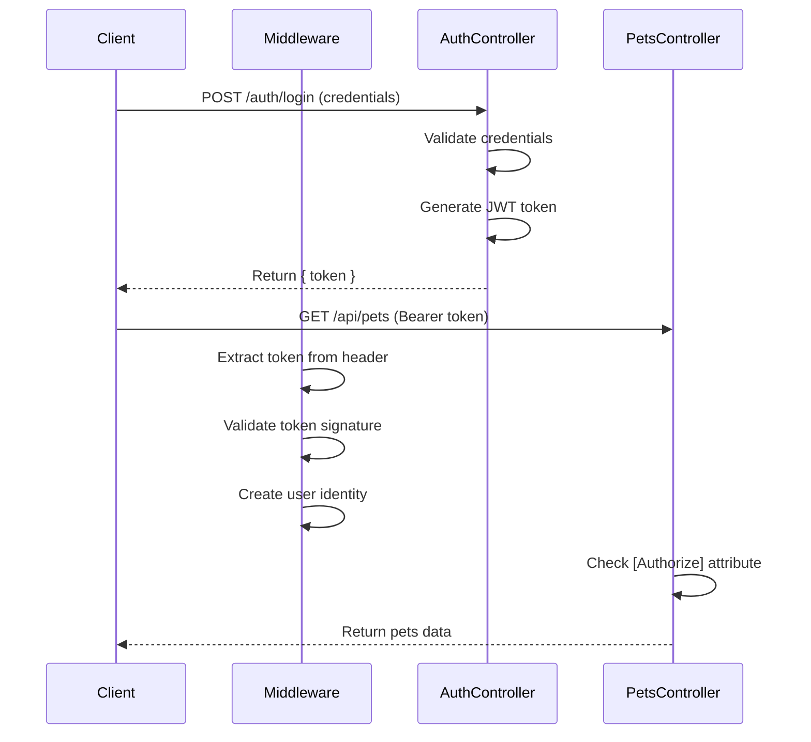

# Authentication and JWT

## Overview

The PetLink API implements JWT (JSON Web Token) based authentication using a **service layer architecture**. This provides secure, stateless user authentication that works seamlessly with the Angular frontend while maintaining clean separation of concerns.

## JWT Authentication Architecture

### 1. Service Layer Design

- **IAuthService**: Interface defining authentication contracts
- **AuthService**: Business logic implementation for authentication
- **AuthController**: HTTP endpoint handling (delegates to service)

### 2. Token Generation - Login Process
### 3. Token Validation - Request Authentication  
### 4. Security Configuration - Middleware Setup
### 5. Authorization - Protected Endpoints

## Authentication Service Layer

### IAuthService Interface (`Interfaces/IAuthService.cs`)

Defines the authentication service contract:

```csharp
using PetLink.API.Models;

namespace PetLink.API.Interfaces
{
    public interface IAuthService
    {
        Task<LoginResponse?> AuthenticateAsync(LoginRequest request);
        Task<bool> ValidateUserAsync(string username, string password);
        string GenerateJwtToken(string username);
    }
}
```

**Key Methods**:

- **AuthenticateAsync**: Handles complete authentication flow
- **ValidateUserAsync**: Validates user credentials  
- **GenerateJwtToken**: Creates JWT tokens for authenticated users

### AuthService Implementation (`Services/AuthService.cs`)

Contains all authentication business logic:

```csharp
using Microsoft.IdentityModel.Tokens;
using PetLink.API.Interfaces;
using PetLink.API.Models;
using System.IdentityModel.Tokens.Jwt;
using System.Security.Claims;
using System.Text;

namespace PetLink.API.Services
{
    public class AuthService : IAuthService
    {
        // Demo credentials - in a real application, this would come from a database
        private const string DemoUsername = "admin";
        private const string DemoPassword = "password";
        private const string SecretKey = "this is my custom Secret key for authentication";

        public Task<LoginResponse?> AuthenticateAsync(LoginRequest request)
        {
            if (!ValidateUserAsync(request.Username, request.Password).Result)
                return Task.FromResult<LoginResponse?>(null);

            var token = GenerateJwtToken(request.Username);
            return Task.FromResult<LoginResponse?>(new LoginResponse { Token = token });
        }

        public Task<bool> ValidateUserAsync(string username, string password)
        {
            // In a real application, this would validate against a database
            // with proper password hashing
            var isValid = username == DemoUsername && password == DemoPassword;
            return Task.FromResult(isValid);
        }

        public string GenerateJwtToken(string username)
        {
            var tokenHandler = new JwtSecurityTokenHandler();
            var key = Encoding.UTF8.GetBytes(SecretKey);

            var tokenDescriptor = new SecurityTokenDescriptor
            {
                Subject = new ClaimsIdentity(new[] 
                { 
                    new Claim(ClaimTypes.Name, username),
                    new Claim(ClaimTypes.NameIdentifier, username)
                }),
                Expires = DateTime.UtcNow.AddHours(1),
                SigningCredentials = new SigningCredentials(
                    new SymmetricSecurityKey(key), 
                    SecurityAlgorithms.HmacSha256Signature)
            };

            var token = tokenHandler.CreateToken(tokenDescriptor);
            return tokenHandler.WriteToken(token);
        }
    }
}
```

## AuthController (`Controllers/AuthController.cs`)

Handles HTTP requests and delegates to the authentication service:

```csharp
using Microsoft.AspNetCore.Mvc;
using PetLink.API.Interfaces;
using PetLink.API.Models;

[ApiController]
[Route("auth")]
public class AuthController : ControllerBase
{
    private readonly IAuthService _authService;

    public AuthController(IAuthService authService)
    {
        _authService = authService;
    }

    [HttpPost("login")]
    public async Task<IActionResult> Login([FromBody] LoginRequest request)
    {
        try
        {
            if (!ModelState.IsValid)
                return BadRequest(ModelState);

            Console.WriteLine($"Login attempt: Username={request.Username}, Password={request.Password}");

            var result = await _authService.AuthenticateAsync(request);
            if (result == null)
                return Unauthorized(new { message = "Invalid username or password." });

            return Ok(new { token = result.Token });
        }
        catch (Exception ex)
        {
            return StatusCode(500, new { message = "An error occurred during authentication.", details = ex.Message });
        }
    }
}
        };

        var token = tokenHandler.CreateToken(tokenDescriptor);
        var tokenString = tokenHandler.WriteToken(token);

        return Ok(new { token = tokenString });
    }
}

public class LoginRequest
{
    public string Username { get; set; }
    public string Password { get; set; }
}
```

### Controller Analysis

#### Route Configuration

```csharp
[ApiController]
[Route("auth")]
```

**Route Structure**:

- **Base Route**: `/auth` - Groups authentication endpoints
- **ApiController**: Enables automatic model validation and binding
- **Full URL**: `http://localhost:5000/auth/login`

#### Login Endpoint

```csharp
[HttpPost("login")]
public IActionResult Login([FromBody] LoginRequest request)
```

**HTTP Method**: POST - Appropriate for authentication data

**Request Binding**: `[FromBody]` - Expects JSON payload

**Return Type**: `IActionResult` - Flexible response handling

#### Demo Credentials

```csharp
private const string DemoUsername = "admin";
private const string DemoPassword = "password";
```

**Development Setup**:

- Hardcoded credentials for demo purposes
- Production would use database validation
- Password hashing required for real applications

#### Token Generation Process

```csharp
var tokenHandler = new JwtSecurityTokenHandler();
var key = Encoding.UTF8.GetBytes(SecretKey);

var tokenDescriptor = new SecurityTokenDescriptor
{
    Subject = new ClaimsIdentity(new[] { new Claim(ClaimTypes.Name, request.Username) }),
    Expires = DateTime.UtcNow.AddHours(1),
    SigningCredentials = new SigningCredentials(
        new SymmetricSecurityKey(key), 
        SecurityAlgorithms.HmacSha256Signature)
};
```

**Token Components**:

1. **Handler**: `JwtSecurityTokenHandler` - Creates and validates tokens
2. **Signing Key**: Symmetric key for token signature
3. **Claims**: User identity information stored in token
4. **Expiration**: 1-hour token lifetime
5. **Algorithm**: HMAC SHA256 for signing

### JWT Token Structure

#### Token Components

**Header**:

```json
{
  "typ": "JWT",
  "alg": "HS256"
}
```

**Payload (Claims)**:

```json
{
  "http://schemas.xmlsoap.org/ws/2005/05/identity/claims/name": "admin",
  "exp": 1642789200,
  "iat": 1642785600
}
```

**Signature**:

```
HMACSHA256(
  base64UrlEncode(header) + "." + base64UrlEncode(payload),
  secret
)
```

#### Claims Identity

```csharp
Subject = new ClaimsIdentity(new[] { new Claim(ClaimTypes.Name, request.Username) })
```

**Claims Purpose**:

- Store user identity information
- Available in protected controllers
- Basis for authorization decisions

## JWT Configuration (Program.cs)

Sets up JWT authentication middleware in the application pipeline.

```csharp
var key = "this is my custom Secret key for authentication";

builder.Services.AddAuthentication("Bearer")
    .AddJwtBearer("Bearer", options =>
    {
        options.TokenValidationParameters = new()
        {
            ValidateIssuer = false,
            ValidateAudience = false,
            ValidateIssuerSigningKey = true,
            IssuerSigningKey = new SymmetricSecurityKey(System.Text.Encoding.UTF8.GetBytes(key))
        };
    });
```

### Authentication Configuration

#### Service Registration

```csharp
builder.Services.AddAuthentication("Bearer")
```

**Default Scheme**: "Bearer" - Standard for JWT tokens

**Scheme Selection**: Automatic Bearer token recognition

#### Token Validation Parameters

```csharp
options.TokenValidationParameters = new()
{
    ValidateIssuer = false,           // Skip issuer validation (demo)
    ValidateAudience = false,         // Skip audience validation (demo)
    ValidateIssuerSigningKey = true,  // Verify token signature
    IssuerSigningKey = new SymmetricSecurityKey(System.Text.Encoding.UTF8.GetBytes(key))
}
```

**Validation Rules**:

- **Issuer**: Disabled for demo (would validate token creator)
- **Audience**: Disabled for demo (would validate token recipient)
- **Signature**: Enabled - Ensures token integrity
- **Key**: Same key used for signing and validation

### Middleware Pipeline Integration

```csharp
app.UseAuthentication();
app.UseAuthorization();
app.MapControllers();
```

**Processing Order**:

1. **Authentication**: Validates JWT tokens and populates user identity
2. **Authorization**: Checks user permissions for endpoints
3. **Controllers**: Routes to appropriate action methods

## Token Validation Flow

### Request Processing



### Authentication Process

1. **Token Extraction**: Middleware reads Authorization header
2. **Format Validation**: Checks "Bearer {token}" format
3. **Signature Verification**: Validates token hasn't been tampered with
4. **Claims Extraction**: Populates user identity from token claims
5. **Identity Creation**: Creates authenticated user context

## Protected Controller Usage

### PetsController Authorization

```csharp
[ApiController]
[Route("api/pets")]
[Authorize]  // Requires authentication
public class PetsController : ControllerBase
{
    [HttpGet]
    public IActionResult GetPets()
    {
        // Only accessible with valid JWT token
        var username = User.Identity.Name; // Available from token claims
        
        var pets = new[]
        {
            new { Id = 1, Name = "Fluffy", Type = "Cat", Adopted = false },
            new { Id = 2, Name = "Rover", Type = "Dog", Adopted = true }
        };
        return Ok(pets);
    }
}
```

#### Authorization Attribute

```csharp
[Authorize]
```

**Function**: Requires authenticated user for all controller actions

**Effect**: Returns 401 Unauthorized if no valid token

**Scope**: Applied at controller level affects all actions

#### User Context Access

```csharp
var username = User.Identity.Name; // From JWT claims
```

**User Property**: Populated by authentication middleware

**Claims Access**: Available user information from token

## Security Considerations

### Token Security

**Strengths**:

- **Stateless**: No server-side session storage
- **Signed**: Cannot be tampered with
- **Time-limited**: Expires after 1 hour
- **Claims-based**: Carries user information

**Production Improvements**:

- **Stronger Secret**: Use cryptographically secure random key
- **Key Management**: Store secrets in configuration/key vault
- **HTTPS Only**: Prevent token interception
- **Shorter Expiration**: Reduce exposure window

### Demo vs Production

**Current Demo Setup**:

```csharp
private const string SecretKey = "this is my custom Secret key for authentication";
private const string DemoUsername = "admin";
private const string DemoPassword = "password";
```

**Production Requirements**:

```csharp
// Configuration-based secrets
var secretKey = configuration["Jwt:SecretKey"];

// Database user validation
var user = await userService.ValidateAsync(request.Username, request.Password);

// Password hashing
var hashedPassword = BCrypt.Net.BCrypt.HashPassword(password);
```

## Error Handling

### Authentication Errors

**Invalid Credentials**:

```csharp
if (request.Username != DemoUsername || request.Password != DemoPassword)
    return Unauthorized(); // 401 status code
```

**Missing Token**:

- Middleware automatically returns 401 for protected endpoints
- No additional code required in controllers

**Invalid Token**:

- JWT validation failures return 401
- Includes expired, malformed, or invalid signature tokens

### Response Formats

**Successful Login**:

```json
{
  "token": "eyJhbGciOiJIUzI1NiIsInR5cCI6IkpXVCJ9..."
}
```

**Failed Login**:

```
Status: 401 Unauthorized
```

## Best Practices Implemented

1. **Stateless Authentication**: No server-side session storage
2. **Standard Bearer Scheme**: Industry-standard JWT implementation
3. **Claims-based Identity**: Flexible user information storage
4. **Middleware Integration**: Automatic authentication handling
5. **Controller Protection**: Simple [Authorize] attribute usage

## Future Enhancements

### Production Improvements

- **User Database**: Real user storage and validation
- **Password Hashing**: Secure password storage
- **Role-based Authorization**: Granular permission controls
- **Refresh Tokens**: Long-term authentication without re-login
- **Token Blacklisting**: Revoke compromised tokens

### Advanced Features

- **Multi-factor Authentication**: Enhanced security
- **OAuth Integration**: Third-party authentication providers
- **API Rate Limiting**: Prevent abuse
- **Audit Logging**: Track authentication events

## Next Steps

- [Controllers and Endpoints](./03-controllers-endpoints.md)
- [Security and CORS](./04-security-cors.md)
