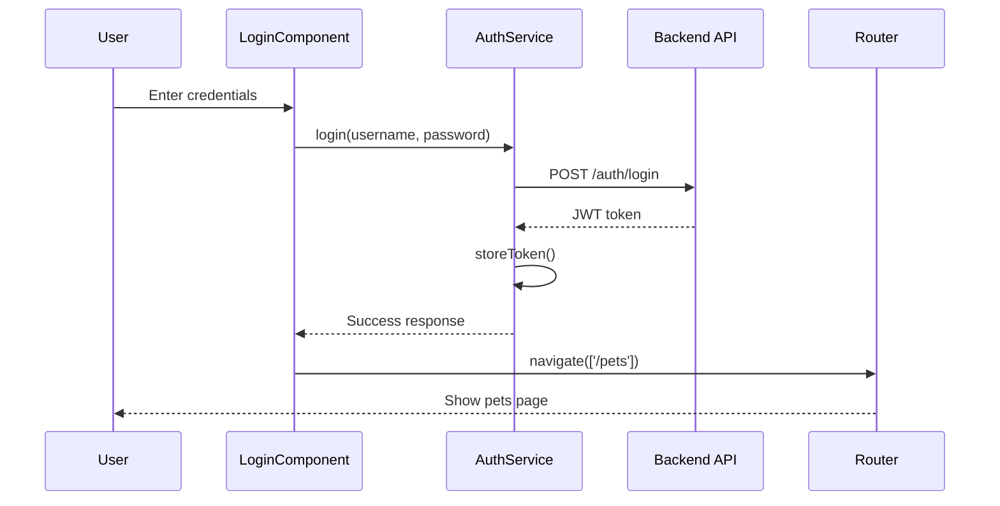
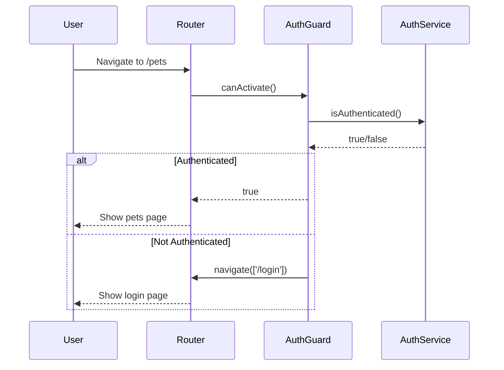

# Authentication System

## Overview

The PetLink authentication system is built around JWT (JSON Web Tokens) and provides secure user authentication with token-based authorization. The system includes login functionality, token management, and route protection.

## Architecture Components

### 1. AuthService - Core Authentication Logic
### 2. AuthGuard - Route Protection
### 3. AuthInterceptor - HTTP Request Enhancement
### 4. LoginComponent - User Interface

## AuthService (`auth.service.ts`)

The central service that handles all authentication operations.

```typescript
import { Injectable } from '@angular/core';
import { HttpClient } from '@angular/common/http';
import { Router } from '@angular/router';
import { environment } from '../core/environment';

@Injectable({ providedIn: 'root' })
export class AuthService {
  private tokenKey = 'jwtToken';

  constructor(private http: HttpClient, private router: Router) {}

  login(username: string, password: string) {
    return this.http.post<{ token: string }>(environment.apiUrl + '/auth/login', { username, password });
  }

  storeToken(token: string) {
    localStorage.setItem(this.tokenKey, token);
  }

  getToken(): string | null {
    return localStorage.getItem(this.tokenKey);
  }

  isAuthenticated(): boolean {
    return !!this.getToken();
  }

  logout() {
    localStorage.removeItem(this.tokenKey);
    this.router.navigate(['/login']);
  }
}
```

### Service Methods Breakdown

#### `login(username: string, password: string)`

**Purpose**: Authenticates user credentials with the backend API

**Process**:
1. Sends POST request to `/auth/login` endpoint
2. Returns Observable with JWT token response
3. Handles authentication validation server-side

**Return Type**: `Observable<{ token: string }>`

#### `storeToken(token: string)`

**Purpose**: Securely stores JWT token in browser's localStorage

**Security Considerations**:
- Uses consistent token key (`jwtToken`)
- localStorage persists across browser sessions
- Token available for HTTP interceptor usage

#### `getToken(): string | null`

**Purpose**: Retrieves stored JWT token for API requests

**Usage**:
- Called by HTTP interceptor
- Used for authentication state checking
- Returns null if no token exists

#### `isAuthenticated(): boolean`

**Purpose**: Checks if user is currently authenticated

**Logic**: Uses double negation (`!!`) to convert token existence to boolean

**Use Cases**:
- Route guard validation
- UI conditional rendering
- Component logic decisions

#### `logout()`

**Purpose**: Clears authentication state and redirects to login

**Process**:
1. Removes token from localStorage
2. Navigates user back to login page
3. Ensures clean logout state

## LoginComponent (`login.component.ts`)

Provides the user interface for authentication.

```typescript
import { Component } from '@angular/core';
import { AuthService } from '../core/auth.service';
import { Router } from '@angular/router';
import { MatFormFieldModule } from '@angular/material/form-field';
import { MatInputModule } from '@angular/material/input';
import { FormsModule } from '@angular/forms';

@Component({
  selector: 'app-login',
  standalone: true,
  templateUrl: './login.component.html',
  imports: [MatFormFieldModule, MatInputModule, FormsModule],
})
export class LoginComponent {
  username = '';
  password = '';

  constructor(private auth: AuthService, private router: Router) {}

  login() {
    this.auth.login(this.username, this.password).subscribe({
      next: res => {
        this.auth.storeToken(res.token);
        this.router.navigate(['/pets']);
      },
      error: () => alert('Invalid credentials')
    });
  }
}
```

### Component Features

#### Standalone Component Architecture

- **Self-contained**: Imports its own dependencies
- **Material Design**: Uses Angular Material for UI components
- **Form Handling**: Implements two-way data binding with FormsModule

#### Login Flow

1. **User Input**: Binds form fields to component properties
2. **Submit**: Calls AuthService.login() with credentials
3. **Success Handler**: Stores token and navigates to pets page
4. **Error Handler**: Shows alert for invalid credentials

#### Reactive Programming

Uses RxJS Observable pattern for asynchronous operations:

```typescript
this.auth.login(this.username, this.password).subscribe({
  next: res => { /* Success handling */ },
  error: () => { /* Error handling */ }
});
```

## AuthGuard (`auth.guard.ts`)

Protects routes from unauthorized access.

```typescript
import { Injectable } from '@angular/core';
import { CanActivate, Router } from '@angular/router';
import { AuthService } from './auth.service';

@Injectable({ providedIn: 'root' })
export class AuthGuard implements CanActivate {
  constructor(private auth: AuthService, private router: Router) {}

  canActivate(): boolean {
    if (this.auth.isAuthenticated()) {
      return true;
    }
    this.router.navigate(['/login']);
    return false;
  }
}
```

### Guard Functionality

#### `canActivate(): boolean`

**Purpose**: Determines if route can be activated

**Logic**:
1. Check if user is authenticated
2. Allow access if authenticated (return true)
3. Redirect to login if not authenticated
4. Deny access (return false)

**Integration**: Applied to protected routes in routing configuration

## AuthInterceptor (`auth.interceptor.ts`)

Automatically adds JWT token to HTTP requests.

### Key Responsibilities

1. **Token Injection**: Adds Authorization header to outgoing requests
2. **API Targeting**: Only affects requests to the backend API
3. **Automatic Handling**: No manual token management in components

### Typical Implementation Pattern

```typescript
// Intercepts HTTP requests and adds Bearer token
req = req.clone({
  setHeaders: {
    Authorization: `Bearer ${token}`
  }
});
```

## Authentication Flow

### Complete Login Process



### Route Protection Flow



## Security Features

### Token Storage

- **LocalStorage**: Persists across browser sessions
- **Consistent Key**: Uses standardized token key
- **Automatic Cleanup**: Removed on logout

### Request Security

- **Bearer Token**: Standard JWT authorization header
- **Automatic Injection**: No manual token handling needed
- **API Scoped**: Only affects backend API requests

### Route Protection

- **Guard-based**: Prevents unauthorized route access
- **Automatic Redirect**: Seamless user experience
- **State Preservation**: Returns to intended route after login

## Best Practices Implemented

1. **Single Responsibility**: Each service handles specific auth concerns
2. **Reactive Programming**: Uses Observables for async operations
3. **Error Handling**: Provides user feedback on failures
4. **Security First**: Guards protect sensitive routes
5. **Token Management**: Centralized token storage and retrieval
6. **User Experience**: Automatic redirects and state management

## Demo Credentials

For development and testing:

- **Username**: `admin`
- **Password**: `password`

## Next Steps

- [Pet Management Components](./04-pet-management.md)
- [Services and HTTP Communication](./05-services-http.md)
