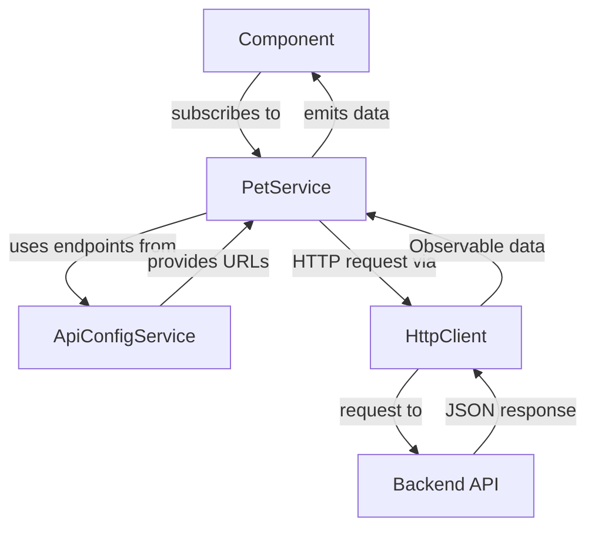

# Services and HTTP Communication

## Overview

Angular services provide reusable business logic and handle HTTP communication with backend APIs. The PetLink application uses three main services: `AuthService`, `PetService`, and `ApiConfigService`, all implementing reactive patterns with RxJS Observables and centralized API configuration.

## Service Architecture

### 1. Dependency Injection System
### 2. HTTP Client Integration  
### 3. Observable-based Communication
### 4. Centralized API Configuration
### 5. Error Handling Strategies

## HTTP Interceptor Integration

### Transparent Authentication

Services no longer need to handle authentication manually:

```typescript
// Before interceptors (manual auth handling)
getPets(): Observable<Pet[]> {
  const headers = new HttpHeaders({
    'Authorization': `Bearer ${this.auth.getToken()}`
  });
  
  return this.http.get<Pet[]>(this.apiUrl, { headers });
}

// After interceptors (automatic auth)
getPets(): Observable<Pet[]> {
  return this.http.get<Pet[]>(this.apiUrl);
  // AuthInterceptor automatically adds Authorization header
}
```

### Centralized Error Handling

```typescript
// Before interceptors (manual error handling)
getPets(): Observable<Pet[]> {
  return this.http.get<Pet[]>(this.apiUrl).pipe(
    catchError(error => {
      console.error('Error:', error);
      if (error.status === 401) {
        this.router.navigate(['/login']);
      }
      return throwError(() => error);
    })
  );
}

// After interceptors (automatic error handling)
getPets(): Observable<Pet[]> {
  return this.http.get<Pet[]>(this.apiUrl);
  // GlobalErrorInterceptor handles all errors automatically
  // User notifications, auth redirects, logging all handled
}
```

### Service Simplification Benefits

**Reduced Boilerplate**:

- No repeated authentication logic
- No repeated error handling patterns  
- Services focus on business logic only

**Consistency**:

- All HTTP calls get same treatment
- Uniform error handling across features
- Centralized authentication management

## PetService (`pet.service.ts`)

Handles all pet-related data operations and API communication.

```typescript
import { Injectable } from '@angular/core';
import { HttpClient } from '@angular/common/http';
import { Observable } from 'rxjs';
import { Pet } from '../pets/pet.model';
import { ApiConfigService } from '../core/api-config.service';

@Injectable({ providedIn: 'root' })
export class PetService {

  constructor(
    private http: HttpClient,
    private apiConfig: ApiConfigService
  ) {}

  getPets(): Observable<Pet[]> {
    return this.http.get<Pet[]>(this.apiConfig.endpoints.pets.list);
  }
}
```

### Service Analysis

#### `@Injectable` Decorator

```typescript
@Injectable({ providedIn: 'root' })
```

**Purpose**: Makes the service available for dependency injection

**`providedIn: 'root'`**:

- Creates singleton instance across the application
- Automatically registered in root injector
- No need to add to providers array in modules
- Enables tree-shaking for unused services

#### Constructor Injection

```typescript
constructor(
  private http: HttpClient,
  private apiConfig: ApiConfigService
) {}
```

**Dependency Injection**:

- **HttpClient**: Angular's built-in HTTP client service
- **ApiConfigService**: Centralized API endpoint configuration
- Both services provide reactive programming patterns
- Clean separation of concerns between HTTP and configuration logic

## AuthService HTTP Operations

The AuthService demonstrates POST operations and token management.

```typescript
login(username: string, password: string) {
  return this.http.post<{ token: string }>(this.apiConfig.endpoints.auth.login, { username, password });
}
```

### HTTP POST Analysis

**Request Structure**:

- **URL**: `this.apiConfig.endpoints.auth.login` - Centralized endpoint configuration
- **Body**: `{ username, password }` - JSON payload
- **Response Type**: `<{ token: string }>` - Expected response shape

**API Configuration Benefits**:

- **Type Safety**: Compile-time validation of endpoint usage
- **Maintainability**: Update URLs in one place
- **Environment Awareness**: Automatic dev/production URL switching

**Automatic Features**:

- JSON serialization of request body
- Content-Type header set to application/json
- Response deserialization to TypeScript object

## ApiConfigService Integration

### Centralized API Configuration

The `ApiConfigService` provides a unified approach to API endpoint management:

```typescript
@Injectable({ providedIn: 'root' })
export class ApiConfigService {
  private readonly baseUrl = environment.apiUrl;

  public readonly endpoints: ApiEndpoints = {
    auth: {
      login: `${this.baseUrl}/auth/login`,
    },
    pets: {
      base: `${this.baseUrl}/api/pets`,
      list: `${this.baseUrl}/api/pets`,
    }
  };
}
```

### Benefits of Centralized Configuration

**Type Safety**:

```typescript
// ✅ Compile-time validation
this.apiConfig.endpoints.pets.list

// ❌ Runtime errors possible
environment.apiUrl + '/api/pets'
```

**Single Source of Truth**:

- All API endpoints defined in one location
- Easy to update and maintain
- Consistent naming across the application

**Environment Integration**:

- Automatically uses environment-specific base URLs
- No manual URL construction needed
- Seamless dev/production switching

## Environment Configuration

### Environment Service Integration

```typescript
// Still used by ApiConfigService for base URL
import { environment } from '../core/environment';
```

**Environment Object Structure**:

```typescript
export const environment = {
  production: false,
  apiUrl: 'http://localhost:5119'  // Used by ApiConfigService
};
```

**Enhanced Benefits with ApiConfigService**:

- **Centralized Base URL**: Environment provides only the base URL
- **Service-level Configuration**: ApiConfigService handles all endpoint paths
- **Type Safety**: TypeScript interfaces prevent endpoint errors
- **Maintainability**: Change endpoints without touching multiple files

## Observable Pattern Deep Dive

### Why Observables?

**Advantages over Promises**:

- **Lazy**: Only execute when subscribed
- **Cancellable**: Can unsubscribe to cancel requests
- **Composable**: Chain operations with operators
- **Multiple Values**: Can emit multiple values over time

### HTTP Observable Characteristics

```typescript
// HTTP Observables are:
// 1. Cold - don't execute until subscribed
// 2. Single-value - emit once then complete
// 3. Automatically unsubscribe on completion
const pets$ = this.petService.getPets();
```

### Subscription Patterns

#### Basic Subscription

```typescript
this.petService.getPets().subscribe(pets => {
  this.pets = pets;
});
```

#### Enhanced Subscription with Error Handling

```typescript
this.petService.getPets().subscribe({
  next: pets => this.pets = pets,
  error: error => console.error('Failed to load pets:', error),
  complete: () => console.log('Request completed')
});
```

## HTTP Interceptors

### AuthInterceptor Integration

The `AuthInterceptor` automatically enhances HTTP requests:

```typescript
// Conceptual implementation
export class AuthInterceptor implements HttpInterceptor {
  intercept(req: HttpRequest<any>, next: HttpHandler): Observable<HttpEvent<any>> {
    const token = this.auth.getToken();
    if (token) {
      req = req.clone({
        setHeaders: { Authorization: `Bearer ${token}` }
      });
    }
    return next.handle(req);
  }
}
```

**Automatic Benefits**:

- No manual token management in services
- Consistent authorization headers
- Centralized request enhancement

## Error Handling Strategies

### Component-Level Error Handling (PetListComponent)

The `PetListComponent` demonstrates comprehensive error handling:

```typescript
ngOnInit(): void {
  this.petService.getPets().subscribe({
    next: pets => this.pets = pets,
    error: err => {
      console.error('Failed to fetch pets:', err);
      alert('Could not load pets. Please try again later.');
    }
  });
}
```

## HTTP Client Features

### Automatic JSON Handling

**Request Serialization**:

```typescript
// JavaScript object automatically converted to JSON
this.http.post('/api/pets', { name: 'Fluffy', type: 'Cat' });
```

**Response Deserialization**:

```typescript
// JSON response automatically parsed to TypeScript object
this.http.get<Pet[]>('/api/pets'); // Returns Observable<Pet[]>
```

### Request Configuration

```typescript
// Custom headers and options
const httpOptions = {
  headers: new HttpHeaders({
    'Content-Type': 'application/json',
    'Authorization': 'Bearer ' + token
  })
};

this.http.get<Pet[]>(this.apiUrl, httpOptions);
```

## Service Communication Patterns

### Service-to-Service Communication

```typescript
// Services can inject other services for enhanced functionality
@Injectable({ providedIn: 'root' })
export class PetService {
  constructor(
    private http: HttpClient,
    private apiConfig: ApiConfigService,  // API configuration
    private auth: AuthService             // Optional: for user context
  ) {}
}
```

### Modern Service Architecture



### Component-Service Communication

The enhanced communication pattern with ApiConfigService:

```typescript
// Component usage remains simple
export class PetListComponent implements OnInit {
  pets: Pet[] = [];

  constructor(private petService: PetService) {}

  ngOnInit(): void {
    this.petService.getPets().subscribe({
      next: pets => this.pets = pets,
      error: err => {
        console.error('Failed to fetch pets:', err);
        alert('Could not load pets. Please try again later.');
      }
    });
  }
}
```

## Best Practices Implemented

### 1. Single Responsibility Principle

- **AuthService**: Handles only authentication logic
- **PetService**: Handles only pet data operations  
- **ApiConfigService**: Manages only API endpoint configuration

### 2. Reactive Programming

- All HTTP operations return Observables
- Components subscribe to handle async responses
- Error handling integrated into Observable streams

### 3. Type Safety

- Generic types for HTTP responses: `<Pet[]>`, `<{token: string}>`
- TypeScript interfaces define data contracts
- ApiConfigService provides compile-time endpoint validation

### 4. Centralized Configuration

- API endpoints managed by dedicated service
- Environment-aware base URL configuration
- Single source of truth for all API URLs

### 5. Comprehensive Error Handling

- Multi-level error handling (service and component)
- User-friendly error messages
- Development-friendly error logging
- Graceful degradation on failures

### 6. Dependency Injection

- Services properly injectable and reusable
- Clean constructor-based dependency management
- Loose coupling between services

## Testing Considerations

### Service Testing

```typescript
// TestBed configuration for service testing
beforeEach(() => {
  TestBed.configureTestingModule({
    imports: [HttpClientTestingModule]
  });
  service = TestBed.inject(PetService);
  httpMock = TestBed.inject(HttpTestingController);
});
```

### HTTP Mock Testing

```typescript
// Mock HTTP responses for unit tests
it('should fetch pets', () => {
  const mockPets: Pet[] = [{ id: 1, name: 'Test Pet', type: 'Dog', adopted: false }];
  
  service.getPets().subscribe(pets => {
    expect(pets).toEqual(mockPets);
  });

  const req = httpMock.expectOne('/api/pets');
  expect(req.request.method).toBe('GET');
  req.flush(mockPets);
});
```

## Future Enhancements

### Possible Service Extensions

- **Caching**: Implement HTTP response caching
- **Retry Logic**: Automatic retry for failed requests
- **Loading States**: Service-level loading indicators
- **Real-time Updates**: WebSocket integration
- **Offline Support**: Local storage fallbacks

## Next Steps

- [Models and Interfaces](./06-models-interfaces.md)
- [API Configuration Service](./08-api-configuration.md) - Deep dive into centralized endpoint management
- [Backend API Structure](../backend-old/01-api-structure.md)
