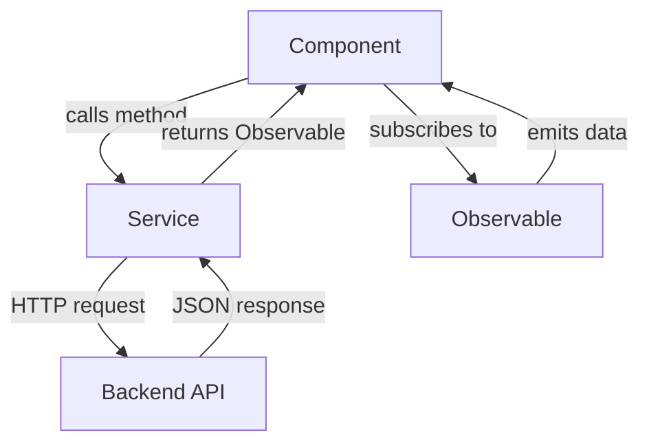

# Services and HTTP Communication

## Overview

Angular services provide reusable business logic and handle HTTP communication with backend APIs. The PetLink application uses two main services: `AuthService` and `PetService`, both implementing reactive patterns with RxJS Observables.

## Service Architecture

### 1. Dependency Injection System
### 2. HTTP Client Integration  
### 3. Observable-based Communication
### 4. Error Handling Strategies

## PetService (`pet.service.ts`)

Handles all pet-related data operations and API communication.

```typescript
import { Injectable } from '@angular/core';
import { HttpClient } from '@angular/common/http';
import { Observable } from 'rxjs';
import { Pet } from '../pets/pet.model';
import { environment } from '../core/environment';

@Injectable({ providedIn: 'root' })
export class PetService {
  private apiUrl = environment.apiUrl + '/api/pets';

  constructor(private http: HttpClient) {}

  getPets(): Observable<Pet[]> {
    return this.http.get<Pet[]>(this.apiUrl);
  }
}
```

### Service Analysis

#### `@Injectable` Decorator

```typescript
@Injectable({ providedIn: 'root' })
```

**Purpose**: Makes the service available for dependency injection

**`providedIn: 'root'`**:

- Creates singleton instance across the application
- Automatically registered in root injector
- No need to add to providers array in modules
- Enables tree-shaking for unused services

#### Constructor Injection

```typescript
constructor(private http: HttpClient) {}
```

**HttpClient Injection**:

- Angular's built-in HTTP client service
- Provides methods for REST API calls (GET, POST, PUT, DELETE)
- Returns Observables for reactive programming
- Handles request/response serialization

#### API URL Configuration

```typescript
private apiUrl = environment.apiUrl + '/api/pets';
```

**Environment-based Configuration**:

- Uses environment variables for API endpoints
- Supports different URLs for development/production
- Centralizes configuration management
- Easier deployment across environments

#### `getPets()` Method

```typescript
getPets(): Observable<Pet[]> {
  return this.http.get<Pet[]>(this.apiUrl);
}
```

**Method Breakdown**:

- **Return Type**: `Observable<Pet[]>` - Reactive stream of Pet array
- **HTTP GET**: Fetches data from the backend API
- **Type Safety**: Generic `<Pet[]>` ensures type checking
- **Lazy Execution**: HTTP call only made when subscribed

## AuthService HTTP Operations

The AuthService demonstrates POST operations and token management.

```typescript
login(username: string, password: string) {
  return this.http.post<{ token: string }>(environment.apiUrl + '/auth/login', { username, password });
}
```

### HTTP POST Analysis

**Request Structure**:

- **URL**: `environment.apiUrl + '/auth/login'`
- **Body**: `{ username, password }` - JSON payload
- **Response Type**: `<{ token: string }>` - Expected response shape

**Automatic Features**:

- JSON serialization of request body
- Content-Type header set to application/json
- Response deserialization to TypeScript object

## Environment Configuration

### Environment Service Integration

```typescript
import { environment } from '../core/environment';
```

**Environment Object Structure**:

```typescript
export const environment = {
  production: false,
  apiUrl: 'http://localhost:5000'
};
```

**Benefits**:

- **Centralized Config**: Single source for environment settings
- **Build-time Replacement**: Different configs for dev/prod builds
- **Type Safety**: IntelliSense support for environment properties

## Observable Pattern Deep Dive

### Why Observables?

**Advantages over Promises**:

- **Lazy**: Only execute when subscribed
- **Cancellable**: Can unsubscribe to cancel requests
- **Composable**: Chain operations with operators
- **Multiple Values**: Can emit multiple values over time

### HTTP Observable Characteristics

```typescript
// HTTP Observables are:
// 1. Cold - don't execute until subscribed
// 2. Single-value - emit once then complete
// 3. Automatically unsubscribe on completion
const pets$ = this.petService.getPets();
```

### Subscription Patterns

#### Basic Subscription

```typescript
this.petService.getPets().subscribe(pets => {
  this.pets = pets;
});
```

#### Enhanced Subscription with Error Handling

```typescript
this.petService.getPets().subscribe({
  next: pets => this.pets = pets,
  error: error => console.error('Failed to load pets:', error),
  complete: () => console.log('Request completed')
});
```

## HTTP Interceptors

### AuthInterceptor Integration

The `AuthInterceptor` automatically enhances HTTP requests:

```typescript
// Conceptual implementation
export class AuthInterceptor implements HttpInterceptor {
  intercept(req: HttpRequest<any>, next: HttpHandler): Observable<HttpEvent<any>> {
    const token = this.auth.getToken();
    if (token) {
      req = req.clone({
        setHeaders: { Authorization: `Bearer ${token}` }
      });
    }
    return next.handle(req);
  }
}
```

**Automatic Benefits**:

- No manual token management in services
- Consistent authorization headers
- Centralized request enhancement

## Error Handling Strategies

### Service-Level Error Handling

```typescript
import { catchError } from 'rxjs/operators';
import { throwError } from 'rxjs';

getPets(): Observable<Pet[]> {
  return this.http.get<Pet[]>(this.apiUrl).pipe(
    catchError(error => {
      console.error('Error fetching pets:', error);
      return throwError(() => new Error('Failed to load pets'));
    })
  );
}
```

### Component-Level Error Handling

```typescript
ngOnInit(): void {
  this.petService.getPets().subscribe({
    next: pets => this.pets = pets,
    error: error => {
      this.errorMessage = 'Unable to load pets. Please try again.';
      this.loading = false;
    }
  });
}
```

## HTTP Client Features

### Automatic JSON Handling

**Request Serialization**:

```typescript
// JavaScript object automatically converted to JSON
this.http.post('/api/pets', { name: 'Fluffy', type: 'Cat' });
```

**Response Deserialization**:

```typescript
// JSON response automatically parsed to TypeScript object
this.http.get<Pet[]>('/api/pets'); // Returns Observable<Pet[]>
```

### Request Configuration

```typescript
// Custom headers and options
const httpOptions = {
  headers: new HttpHeaders({
    'Content-Type': 'application/json',
    'Authorization': 'Bearer ' + token
  })
};

this.http.get<Pet[]>(this.apiUrl, httpOptions);
```

## Service Communication Patterns

### Service-to-Service Communication

```typescript
// AuthService can be injected into other services
@Injectable({ providedIn: 'root' })
export class PetService {
  constructor(
    private http: HttpClient,
    private auth: AuthService  // Service dependency
  ) {}
}
```

### Component-Service Communication



## Best Practices Implemented

### 1. Single Responsibility Principle

- **AuthService**: Handles only authentication logic
- **PetService**: Handles only pet data operations

### 2. Reactive Programming

- All HTTP operations return Observables
- Components subscribe to handle async responses

### 3. Type Safety

- Generic types for HTTP responses: `<Pet[]>`, `<{token: string}>`
- TypeScript interfaces define data contracts

### 4. Environment Configuration

- API URLs externalized to environment files
- Different configurations for different environments

### 5. Dependency Injection

- Services properly injectable and reusable
- Clean constructor-based dependency management

## Testing Considerations

### Service Testing

```typescript
// TestBed configuration for service testing
beforeEach(() => {
  TestBed.configureTestingModule({
    imports: [HttpClientTestingModule]
  });
  service = TestBed.inject(PetService);
  httpMock = TestBed.inject(HttpTestingController);
});
```

### HTTP Mock Testing

```typescript
// Mock HTTP responses for unit tests
it('should fetch pets', () => {
  const mockPets: Pet[] = [{ id: 1, name: 'Test Pet', type: 'Dog', adopted: false }];
  
  service.getPets().subscribe(pets => {
    expect(pets).toEqual(mockPets);
  });

  const req = httpMock.expectOne('/api/pets');
  expect(req.request.method).toBe('GET');
  req.flush(mockPets);
});
```

## Future Enhancements

### Possible Service Extensions

- **Caching**: Implement HTTP response caching
- **Retry Logic**: Automatic retry for failed requests
- **Loading States**: Service-level loading indicators
- **Real-time Updates**: WebSocket integration
- **Offline Support**: Local storage fallbacks

## Next Steps

- [Models and Interfaces](./06-models-interfaces.md)
- [Backend API Structure](../backend/01-api-structure.md)
